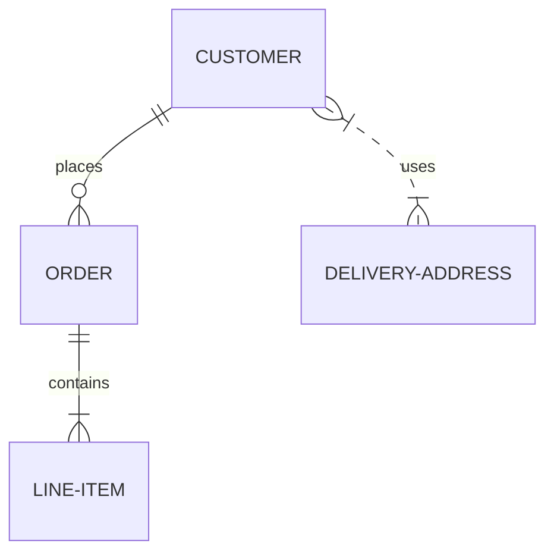
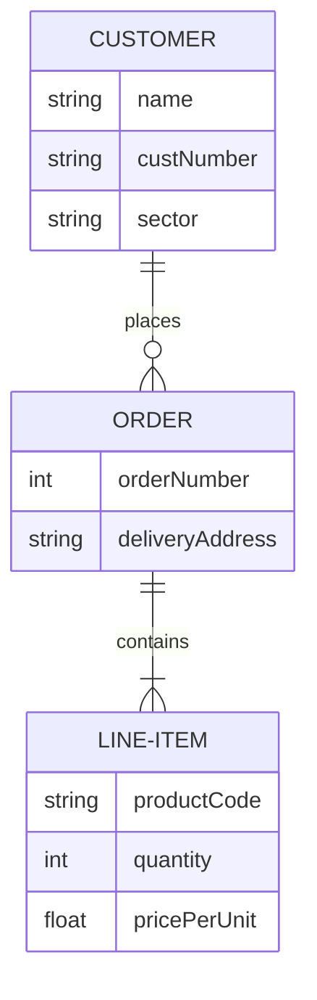
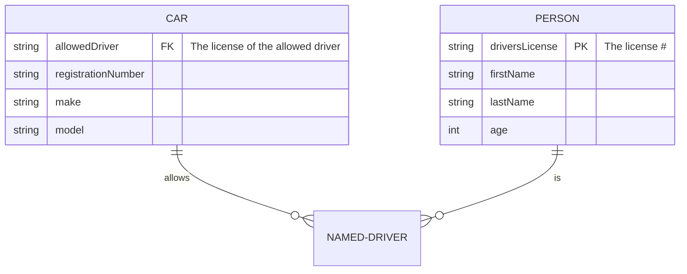

```mermaid
erDiagram
  CUSTOMER ||--o{ ORDER : places
  ORDER ||--|{ LINE-ITEM : contains
  CUSTOMER }|..|{ DELIVERY-ADDRESS : uses
```

```mermaid
erDiagram
  CUSTOMER ||--o{ ORDER : places
  CUSTOMER {
    string name
    string custNumber
    string sector
  }
  ORDER ||--|{ LINE-ITEM : contains
  ORDER {
    int orderNumber
    string deliveryAddress
  }
  LINE-ITEM {
    string productCode
    int quantity
    float pricePerUnit
  }
```

```mermaid
erDiagram
  CAR ||--o{ NAMED-DRIVER : allows
  CAR {
    string allowedDriver FK "The license of the allowed driver"
    string registrationNumber
    string make
    string model
  }
  PERSON ||--o{ NAMED-DRIVER : is
  PERSON {
    string driversLicense PK "The license #"
    string firstName
    string lastName
    int age
  }
```