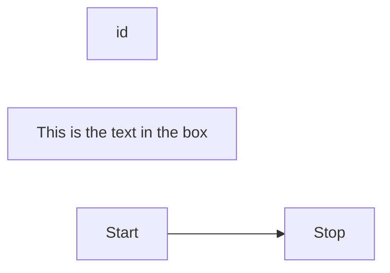
```mermaid
flowchart LR
  id
  id1[This is the text in the box]
  Start --> Stop
```

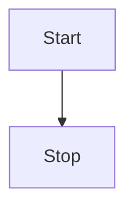
```mermaid
flowchart TD
  Start --> Stop
```

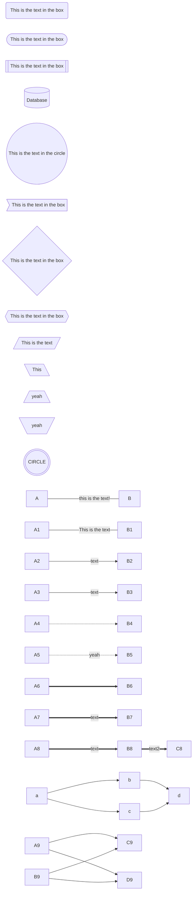
```mermaid
flowchart LR
  id1(This is the text in the box)
  id2([This is the text in the box])
  id3[[This is the text in the box]]
  id4[(Database)]
  id5((This is the text in the circle))
  id6>This is the text in the box]
  id7{This is the text in the box}
  id8{{This is the text in the box}}
  id9[/This is the text/]
  id10[\This\]
  id11[/yeah\]
  id12[\yeah/]
  id13(((CIRCLE)))

  A-- this is the text! ---B
  A1---|This is the text|B1
  A2-->|text|B2
  A3-- text -->B3
  A4-.->B4
  A5-. yeah .->B5
  A6 ==> B6
  A7== text ==>B7
  A8 == text ==> B8 == text2 ==> C8

  a --> b & c --> d
  A9 & B9 --> C9 & D9
```

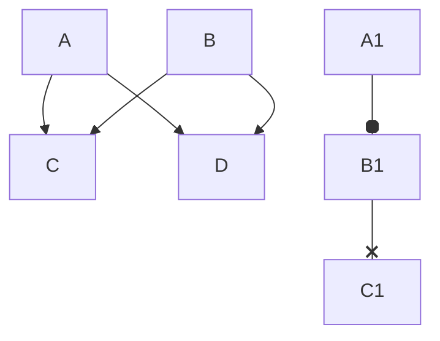
```mermaid
flowchart TB
  A --> C
  A --> D
  B --> C
  B --> D

  A1 --o B1 --x C1
```

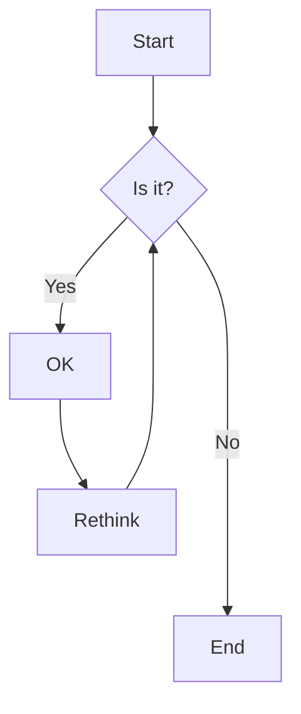
```mermaid
flowchart TD
  A[Start] --> B{Is it?}
  B -->|Yes| C[OK]
  C --> D[Rethink]
  D --> B
  B -- No ----> E[End]
```

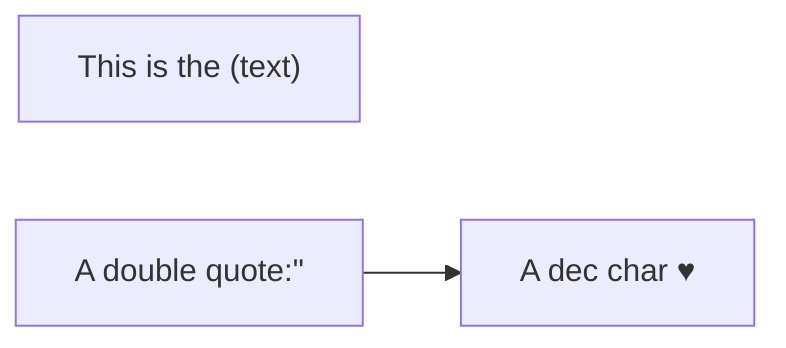
```mermaid
flowchart LR
  id1["This is the (text)"]
  A["A double quote:#quot;"] --> B["A dec char #9829;"]
```

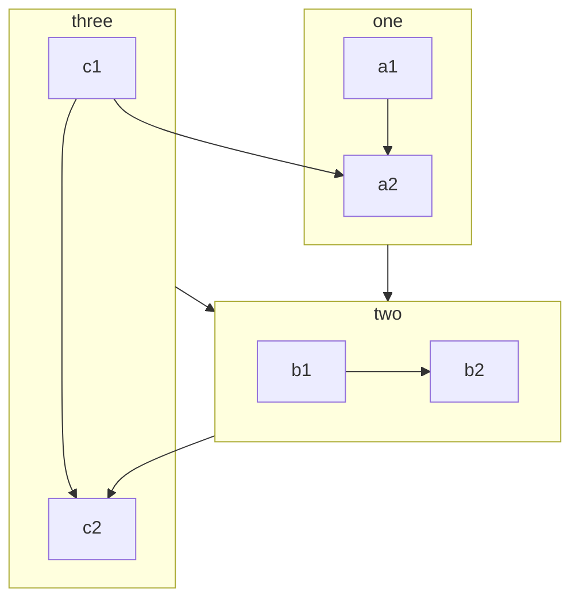
```mermaid
flowchart TB
  c1 --> a2
  subgraph ide1 [one]
    a1 --> a2
  end
  subgraph two
    b1 --> b2
  end
  subgraph three
    c1 --> c2
  end
  ide1 --> two
  three --> two
  two --> c2
```

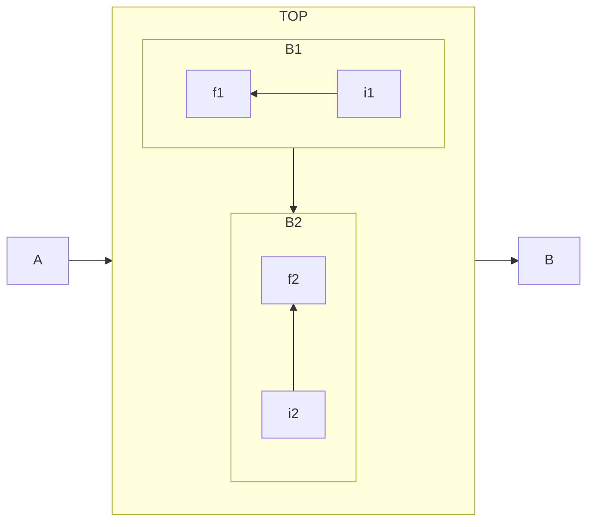
```mermaid
flowchart LR
  subgraph TOP
    direction TB
    subgraph B1
      direction RL
      i1 --> f1
    end
    subgraph B2
      direction BT
      i2 --> f2
    end
    B1 --> B2
  end
  A --> TOP --> B
```

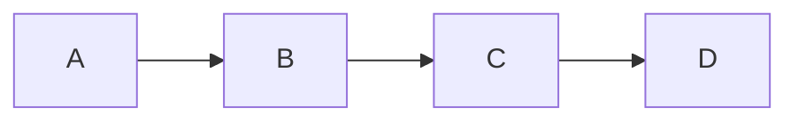
```mermaid
flowchart LR
%% this is a comment
  A --> B
  B --> C
  C --> D
  click A "https://www.github.com"
  click C call callback() "Tooltip"
```

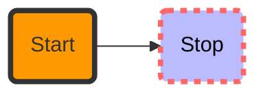
```mermaid
flowchart LR
  id1(Start) --> id2(Stop)
  style id1 fill:#ff9901, stroke:#333, stroke-width:4px
  style id2 fill:#bbf, stroke:#f66, stroke-width:4px, color:#000, stroke-dasharray:5 5
```

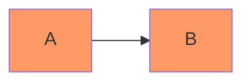
```mermaid
flowchart LR
  A --> B
  classDef someclass fill:#f96;
  class A,B someclass;
```

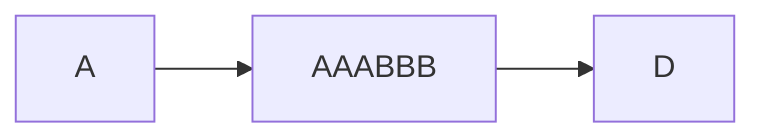
```mermaid
flowchart LR
  A --> B[AAA<span>BBB</span>]
  B --> D
  class A cssClass;
```

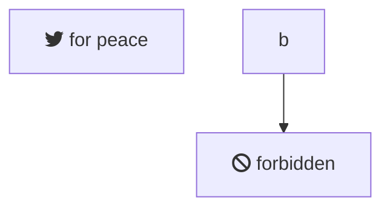
```mermaid
flowchart TD
  B["fab:fa-twitter for peace"]
  b --> C[fa:fa-ban forbidden]
```