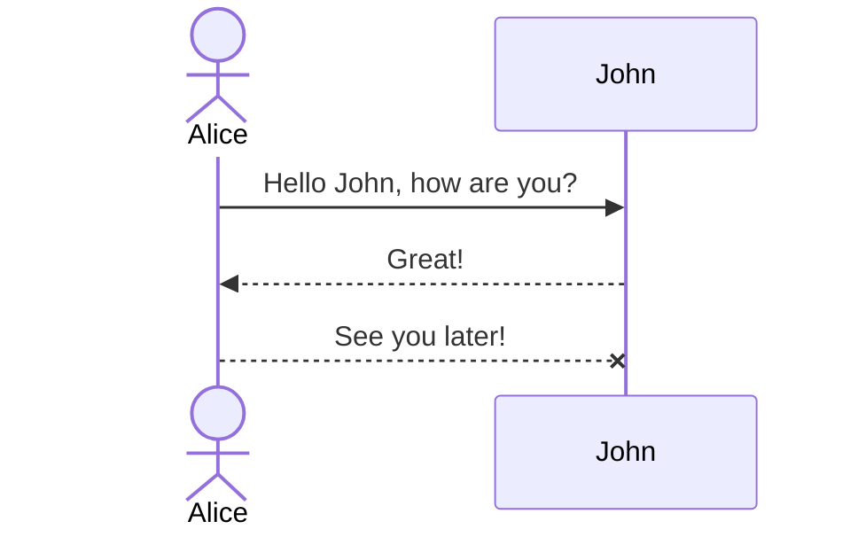
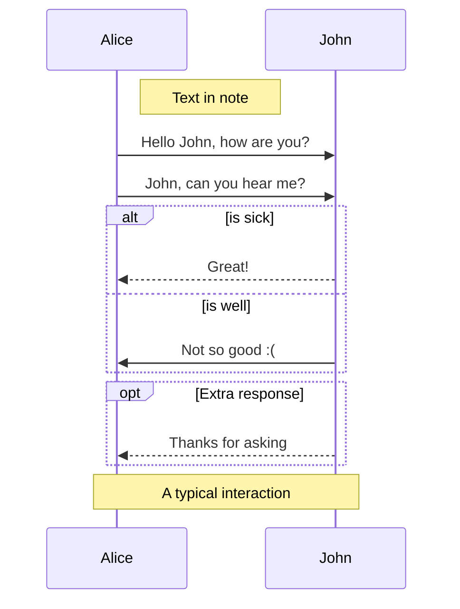
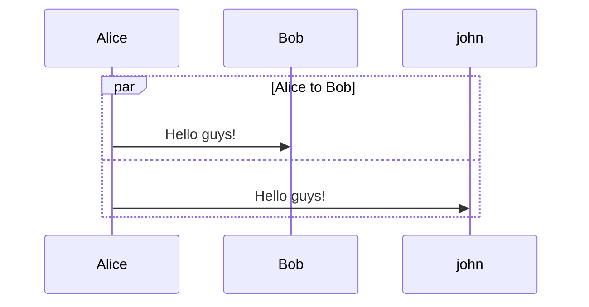
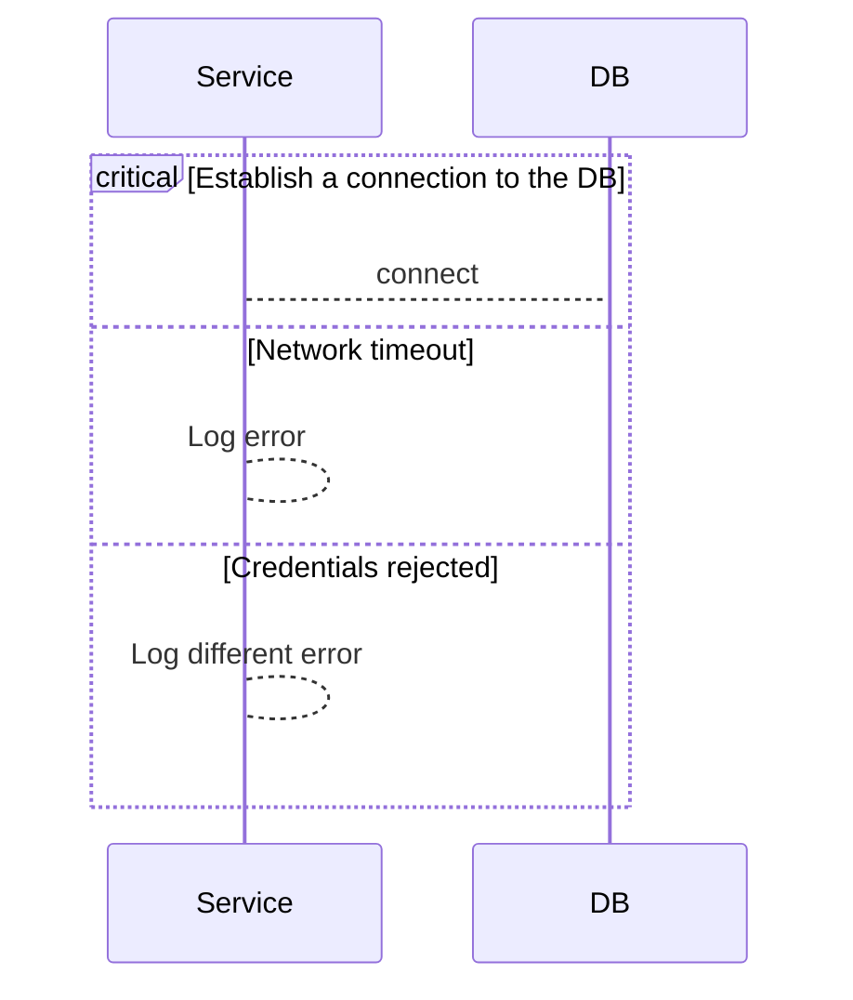

```mermaid
sequenceDiagram
  actor A as Alice
  participant J as John
  A ->> J: Hello John, how are you?
  J -->> A: Great!
  A --x J: See you later!
```

```mermaid
sequenceDiagram
  participant Alice
  Note right of Alice: Text in note
  Alice ->> John: Hello John, how are you?
  Alice ->> John: John, can you hear me?
  alt is sick
    John -->> Alice: Great!
  else is well
    John ->> Alice: Not so good :(
  end
  opt Extra response
    John -->> Alice: Thanks for asking
  end
  Note over Alice,John: A typical interaction
```

```mermaid
sequenceDiagram
  par Alice to Bob
    Alice ->> Bob: Hello guys!
  and
    Alice ->> john: Hello guys!
  end
```

```mermaid
sequenceDiagram
  critical Establish a connection to the DB
    Service --> DB: connect
  option Network timeout
    Service --> Service: Log error
  option Credentials rejected
    Service --> Service: Log different error
  end
```